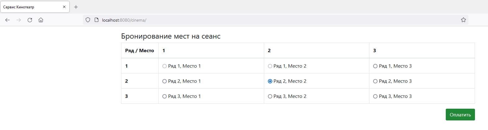

# job4j_cinema

#Проект "Кинотеатр"

**_Проект представляет собой сервис для онлайн бронирования мест в кинотеатре. Был реализован на платформе Java EE, с использованием базы данных Postgres и технологий HTML, JSP, Java Script, Scriptlet, JQuery и Ajax_**

